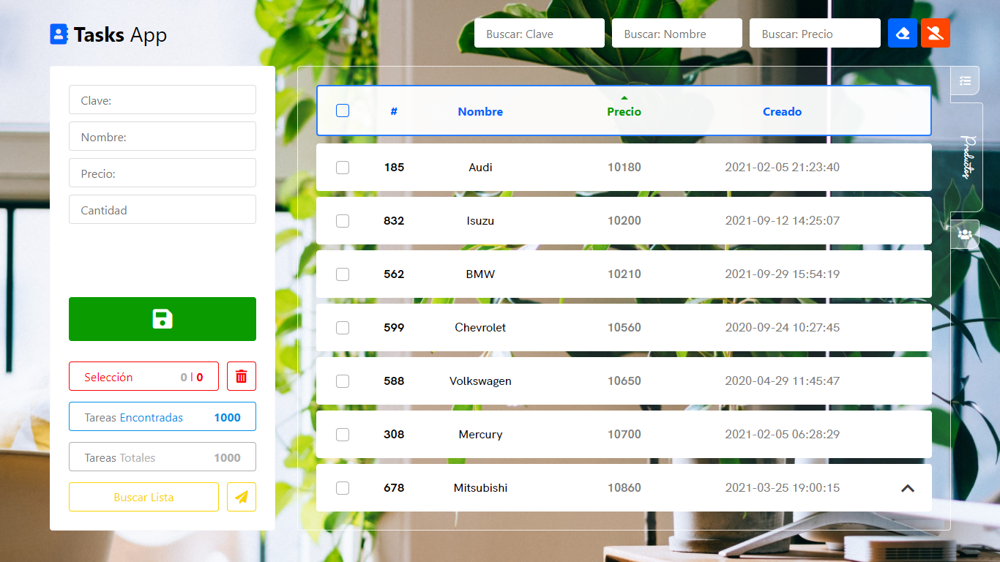

"Tasks App" By David 2020-2022

_Funciones:_

-   Sesiones.
-   Agregar Tareas.
-   Actualizar Tareas.
-   Eliminar Tareas.
-   Buscar Tareas.
-   Ordenar Tareas.
+   Más Funciones.

_Lenguajes & Servidores:_

-   HTML
-   CSS
-   JS
-   PHP
-   MySQL

_Iconos:_

-   Font Awesome 5.14

_Importar Base de Datos:_

-   Crear Base de Datos "tasks-app" (MySQL).
-   Importar "tasks-app.sql" ubicado en la carpeta "db".
-   Cambiar usuario y contraseña en el archivo "connection.php".
-   Listo.

_Screenshots:_

_Pantalla Principal_

